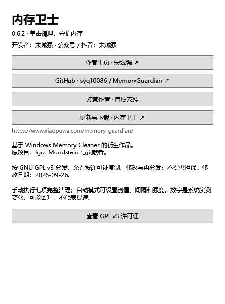

# 内存卫士 · Memory Guardian

一颗常驻 Windows 桌面的 3D 地球，让内存占用看得见，清理触手可及。

[官方网站](https://www.xiaopuwa.com/memory-guardian/) · [下载安装包](https://github.com/syq10086/MemoryGuardian/releases/latest) · [作者主页](https://blog.csdn.net/syq10086?type=blog) · [更新日志](CHANGELOG.md)

免费使用 · Windows 10 / 11 · GNU GPL v3 开源

## 功能预览


*地球悬浮球界面示例；旧版截图中的名称可能与当前版本不同。*

| 功能 | 使用方式 |
| --- | --- |
| 桌面 3D 地球 | 显示实时内存占用，拖动调整位置，支持置顶和大小设置 |
| 蓝红占用提示 | 50% 以下为蓝色，占用升高逐渐变暖，95% 及以上呈红色 |
| 一键清理 | 单击地球执行完整清理，结束后显示可用内存变化 |
| 自动守护 | 复选框启用，滑块设置 60%～95% 阈值，可选清理强度和间隔 |
| 状态与结果 | 显示超标倒计时、冷却状态，并提供逐项清理结果 |
| 托盘与启动 | 托盘找回悬浮球，可选择登录启动 |
| 作者与开源入口 | 在菜单、关于窗口访问作者主页、GitHub 和更新页面 |



*当前版本关于窗口的实际 WPF 界面渲染。*

## 下载与安装

前往 [最新版发布页](https://github.com/syq10086/MemoryGuardian/releases/latest)：

- **Setup.exe**：推荐安装版，支持中文安装向导、桌面快捷方式和卸载。
- **windows.zip**：免安装版，解压后运行 `EarthGuardian.exe`。
- **Source code**：对应版本完整源码，可自行编译。

需要 **.NET Framework 4.8.1**。内部程序名沿用 `EarthGuardian.exe`，以兼容原有安装、配置和启动任务。升级前先退出正在运行的旧版。

清理需要管理员权限，当前安装包尚未数字签名，Windows 可能显示未知发布者或 SmartScreen 提醒。请从本仓库下载，发布页附有 SHA-256 校验值。

## 如何使用

1. **单击地球**立即清理；**拖动**移动位置；**右键**打开设置菜单。
2. 勾选“启用自动清理”，在自动清理设置中拖动阈值滑块。
3. 根据需要选择温和、均衡或完整模式，并设置最短清理间隔。
4. 查看球上的倒计时和冷却提示；在菜单中查看上次优化结果。

新安装默认自动守护：**80% 阈值、持续 30 秒、间隔 10 分钟、均衡模式**。升级保留原有设置。登录启动默认关闭，需要手动启用。

占用超过阈值不会立即触发：需要连续超标 30 秒且冷却结束。手动清理也会开启自动冷却，修改阈值不会清空冷却时间。

## 清理范围与效果

完整模式依次处理进程工作集、系统文件缓存、已修改页面、待机缓存、合并页面、注册表缓存及磁盘待写缓存。均衡模式整理工作集和低优先级缓存；温和模式只处理低优先级缓存。

软件不会主动关闭应用或删除文件。但整理工作集和缓存可能短暂卡顿、增加磁盘活动，内存占用也可能再次回升。显示的释放量是操作前后系统可用物理内存之差，受其他程序活动影响，**不代表速度提升**。长时间计算、渲染或实时任务期间可关闭自动清理。

设置和最近清理报告保存在 `%LOCALAPPDATA%\MemoryOrb`。卸载保留个人配置。

## 支持作者

开发者：**宋域强**；公众号、抖音：**宋域强**。

如果这个小工具对你有帮助，可以通过软件中的“打赏作者”自愿支持。全部功能免费，不打赏也可以正常使用。

## 从源码构建

安装 .NET SDK 8 和 .NET Framework 4.8.1 Developer Pack，然后执行：

```powershell
powershell -ExecutionPolicy Bypass -File scripts/build.ps1
dotnet build tests/MemoryOrb.Tests.csproj -c Release
./tests/bin/Release/net481/MemoryOrb.Tests.exe
```

安装包使用 Inno Setup 6.4.3，通过 `scripts/build-installer.ps1` 构建。网站在 `website/memory-guardian/`，部署方式见 [网站说明](website/DEPLOY.md)。

测试覆盖自动清理规则、设置恢复、内存读取、WPF 界面、二维码资源加载及演示流程。管理员真实清理和长期高负载稳定性仍需实机验证。

## 开源与致谢

本项目基于 [Igor Mundstein / Windows Memory Cleaner](https://github.com/IgorMundstein/WinMemoryCleaner) 二次开发，保留上游源码与版权声明，采用 [GNU GPL v3](LICENSE)。这是独立衍生项目，并非原作者官方版本。

地球海陆纹理采用公有领域 Natural Earth 数据。来源及修改说明见 [NOTICE.md](NOTICE.md)。欢迎提交问题和改进建议。
